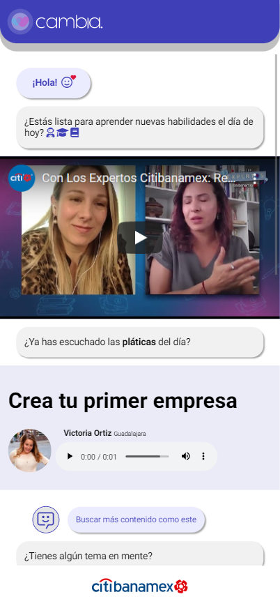
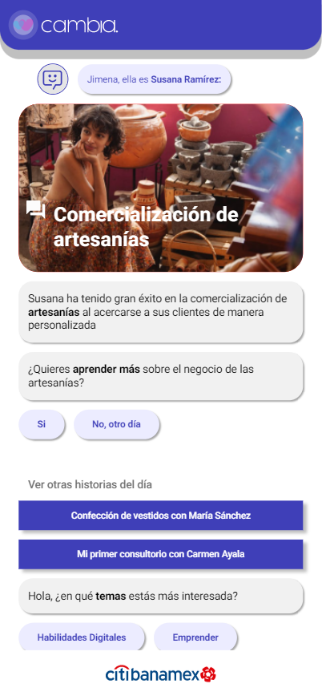

# Talent Land Hackathon 2022 - Proyecto Cambia con Citibanamex

> Alan Badillo
>
> Eduardo Badillo
>
> Marisol Romero

## Recursos generados durante el Hackathon

* [Encuesta In-House](./docs/encuesta.md)
* [Documento de Presentación](./docs/presentacion.md.md)
* [Metología](./docs/metodologia.md)
* [Prototipo](./docs/mockup.md)
* [Pitch 1](./docs/pitch_1.md)
* [Pitch 2](./docs/pitch_2.md)

> Prototipo Funcional en Azure

* [https://calm-wave-022758310.1.azurestaticapps.net](https://calm-wave-022758310.1.azurestaticapps.net)

> Video Pitch en Youtube

* [https://youtu.be/kskgJFP4drE](https://youtu.be/kskgJFP4drE)

## Descripción

**Cambia** es una aplicación que acercará a las mujeres a la **transformación digital**. Nuestro objetivo es crear una **comunidad** para ellas, que les permita generar **capital social** y modelos a seguir en **temas financieros y de negocios**.

A través de **CambiaBot** las mujeres serán parte de **historias éxito** y **rutas de aprendizaje personalizadas** para crear una comunidad positiva que **comparta** su experiencia en temas financieros y de negocios, y así conseguir **romper barreras** sociales y culturales que puedan marginarlas.

## Aplicación

