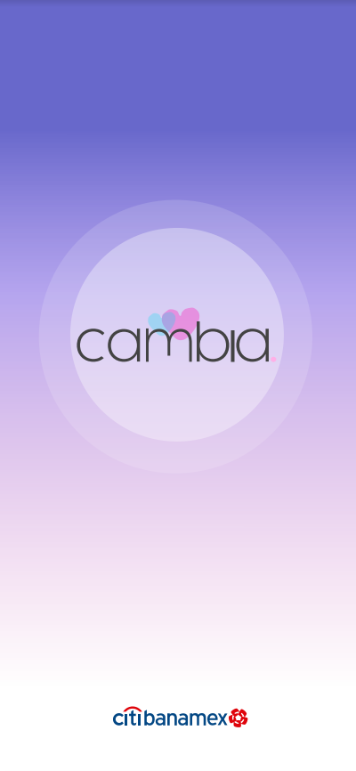
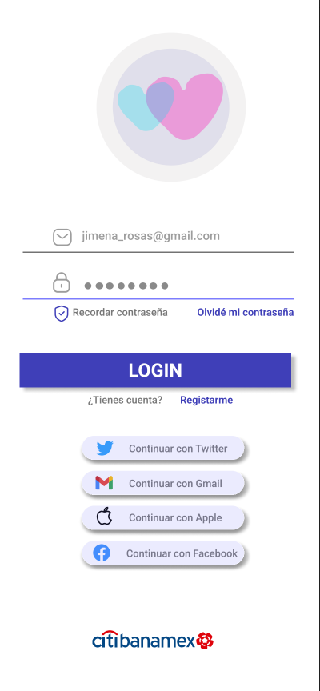
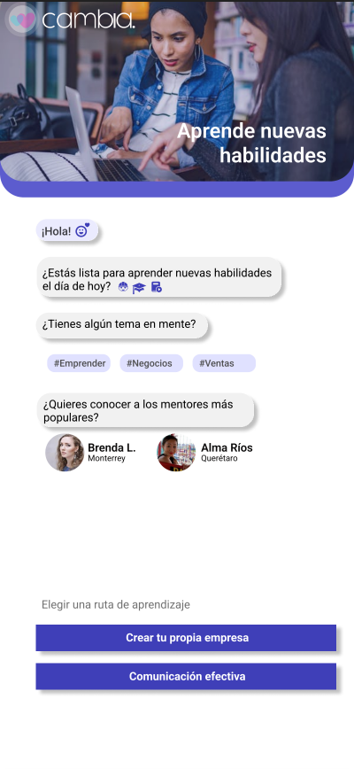
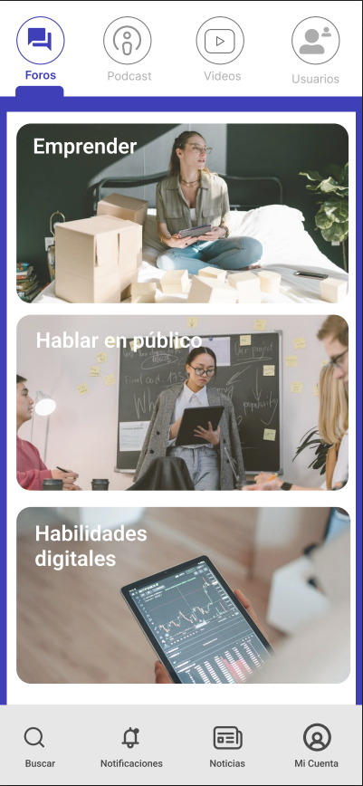
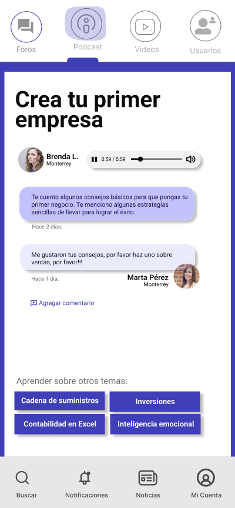
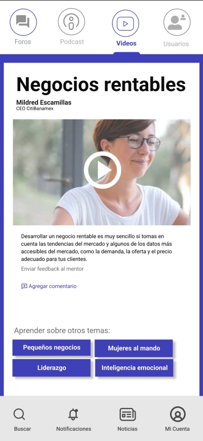
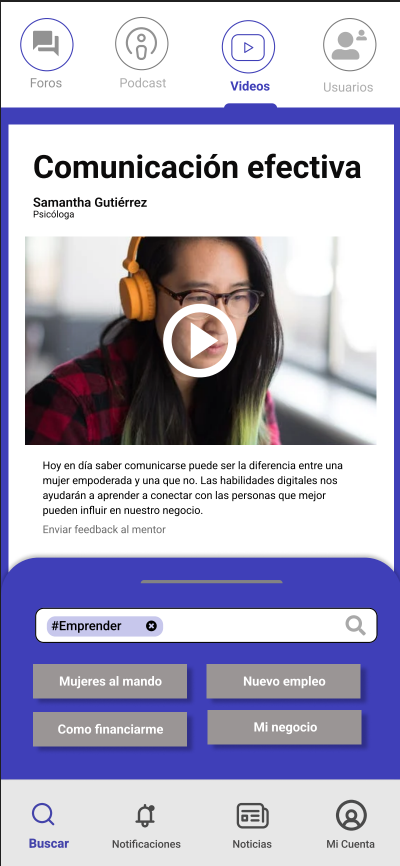

# Talent Land Hackathon 2022 - Proyecto Cambia con Citibanamex

> Alan Badillo
>
> Eduardo Badillo
>
> Marisol Romero

## Descripción

Cambia es una aplicación que acercará a las mujeres a la transformación digital. Nuestro objetivo es crear una comunidad de mujeres fuerte que logre romper los tabús sociales y culturales sobre temas de negocios y finanzas.

A través de CambiaBot las mujeres serán parte de foros, videos, podcast y mensajería con otras mujeres para crear una comunidad positiva que comparta su experiencia en temas financieros y de negocios.

## Aplicación

---

